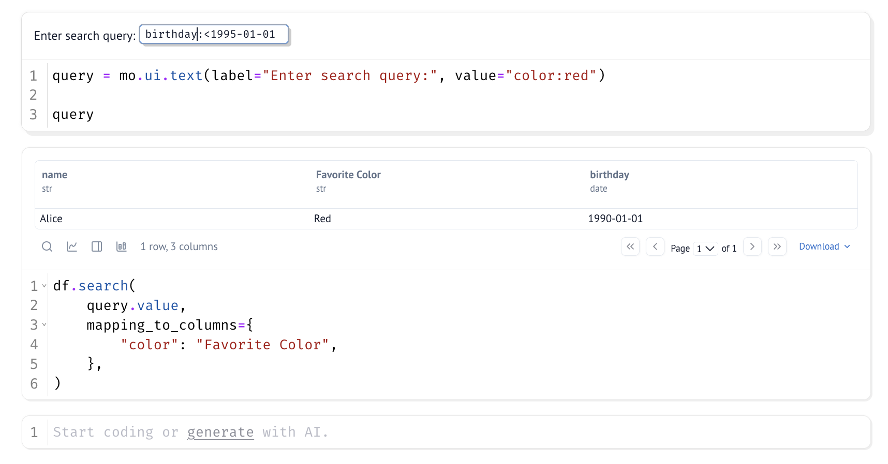

# Frame Search

A GitHub search inspired interface to DataFrames.

Powered by [`narwhals`](https://narwhals-dev.github.io/narwhals/).

## Installation

Install from PyPI:

```terminal
uv add frame-search
```

## Usage

```python
# Import to add `search` property to DataFrames
import frame_search  # noqa: F401

import polars as pl

df = pl.DataFrame({
    "name": ["Alice Smith", "Bob J. Dawkins", "Charlie Brown"],
    "age": [25, 30, 35],
    "hometown": ["New York", "New York", "Chicago"]
})

df.search('age:<30 hometown:"New York"')
```

```text
shape: (1, 3)
┌─────────────┬─────┬──────────┐
│ name        ┆ age ┆ hometown │
│ ---         ┆ --- ┆ ---      │
│ str         ┆ i64 ┆ str      │
╞═════════════╪═════╪══════════╡
│ Alice Smith ┆ 25  ┆ New York │
└─────────────┴─────┴──────────┘
```

Use with [`marimo`](https://marimo.io/) to create a search interface for DataFrames:

```python
import marimo as mo

search = mo.ui.text(label="DataFrame Search Query:")
search
```

Then use on a DataFrame:

```python
import polars as pl

import frame_search  # noqa: F401

df = pl.DataFrame({
    "name": ["Alice Smith", "Bob J. Dawkins", "Charlie Brown"],
    "age": [25, 30, 35],
    "hometown": ["New York", "Los Angeles", "Chicago"]
})

df_filter = df.search(search.value)

df_filter
```

Here is another example in a Marimo notebook:



# Internal API

```python
from frame_search import create_search

search = create_search("Name", {"name": "Full Name", "age": "Current Age", "Hometown": "city"})
```


This search function will work on any DataFrame library supported by `narwhals`. For example, pandas:

```python
import pandas as pd

df = pd.DataFrame({
    "Full Name": ["Alice Smith", "Bob J. Dawkins", "Charlie Brown"],
    "Current Age": [25, 30, 35],
    "Hometown": ["New York", "Los Angeles", "Chicago"]
})

df.pipe(search, "name:alice age:>30 hometown:miami")
```

Or use the `search` property of pandas and polars Frames:

```python
import pandas as pd

# Adds `search` property to DataFrames
import frame_search  # noqa: F401

df = pd.DataFrame({
    "Full Name": ["Alice Smith", "Bob J. Dawkins", "Charlie Brown"],
    "Current Age": [25, 30, 35],
    "Hometown": ["New York", "Los Angeles", "Chicago"]
})

query = "name:alice age:>30 hometown:miami"
df.search(query)

df_pl = pl.DataFrame(df)
df_pl.search(query)
df_pl.lazy().search(query).collect()
```
