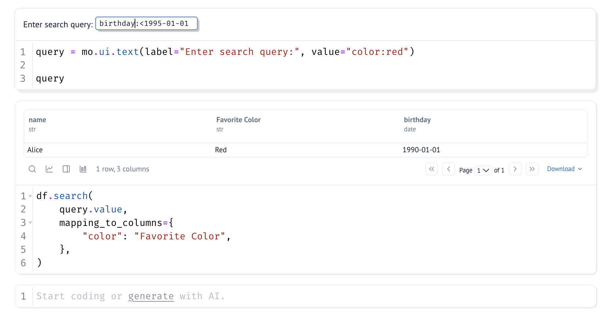

# Frame Search

[](https://github.com/astral-sh/ruff)
[](https://github.com/williambdean/frame-search/actions/workflows/tests.yml)
[](https://badge.fury.io/py/frame-search)

A GitHub search inspired interface to DataFrames.

Powered by [`narwhals`](https://narwhals-dev.github.io/narwhals/).

## Installation

Install from PyPI:

```terminal
uv add frame-search
```

## Usage

### API

Importing `frame_search` adds a `search` properties to pandas and polars objects.

```python
# Import to add `search` property to DataFrames
import frame_search  # noqa: F401

import polars as pl

df = pl.DataFrame({
    "name": ["Alice Smith", "Bob J. Dawkins", "Charlie Brown"],
    "age": [25, 30, 35],
    "hometown": ["New York", "New York", "Chicago"]
})

df.search('age:<30 hometown:"New York"')
```

```text
shape: (1, 3)
┌─────────────┬─────┬──────────┐
│ name        ┆ age ┆ hometown │
│ ---         ┆ --- ┆ ---      │
│ str         ┆ i64 ┆ str      │
╞═════════════╪═════╪══════════╡
│ Alice Smith ┆ 25  ┆ New York │
└─────────────┴─────┴──────────┘
```

### Interactive Search in Marimo Notebooks

Use with [`marimo`](https://marimo.io/) to create a search interface for DataFrames:

```python
import marimo as mo

search = mo.ui.text(label="DataFrame Search Query:")
search
```

Then use on a DataFrame:

```python
import polars as pl

import frame_search  # noqa: F401

df = pl.DataFrame({
    "name": ["Alice Smith", "Bob J. Dawkins", "Charlie Brown"],
    "age": [25, 30, 35],
    "hometown": ["New York", "Los Angeles", "Chicago"]
})

df_filter = df.search(search.value)

df_filter
```

Here is another example in a Marimo notebook:



## Search Expression Grammar

This repository defines a small, expressive query language for filtering and searching structured data.
The grammar is implemented in **Lark** and supports boolean logic, comparisons, ranges, set membership, dates, numbers, strings, and quoted identifiers.

The language is designed to be:

- Readable for humans
- Unambiguous for the parser
- Flexible enough to express common filtering patterns

### Syntax Overview

A query is an **expression** composed of:

- Boolean operators: `AND`, `OR`, `NOT` (with symbolic aliases `&`, `|`, `~`)
- Comparisons between a **key** and a **value**
- Range expressions (`..`)
- Set membership (`value,value,...`)
- Parentheses for grouping

At a high level:

```
<key> <comparator> <search_rhs>
```

Where a **key** identifies the field being queried. A **comparator** represents an operator that compares two sides (e.g. <, >, ==).
**search_rhs** can take on many different values including dates/datetimes, integers/floats, booleans, strings, and other columns.

### Keys

Keys identify the field being queried, and are always inferred to exist on the left side of any comparison.
To refer to column names that have spaces in them, one needs to surround the name in backticks.

```
name:Alice         # queries the name column for the string Alice
`first name`:Alice # queries the `first name` column for the string Alice
`first.name`:Alice # queries the `first.name` column for the string Alice
```

In the above example, both "first name" and "first.name" must be surrounded in backticks.

### Comparators

| Operator | Meaning |
| ----     | ---- |
| `==`     | equality |
| `!=`     | inequality |
| `<`      | less than |
| `<=`     | less than or equal |
| `>`      | greater than |
| `>=`     | greater than or equal |
| `:`      | value dependent |

The `:` operator is special in that it allows for a flexible supset of expressions to be parsed and used

- `str`: `name:Alice` queries the name column for any value that starts with Alice or alice (case-insensitive prefix matching)
- `isin`: `name:Alice,Bob` queries the name column for either Alice or Bob (same as case-insensitive prefix matching for strings)
- `range`: `age:20..40` queries the age column for any value between 20 and 40 (inclusive)
